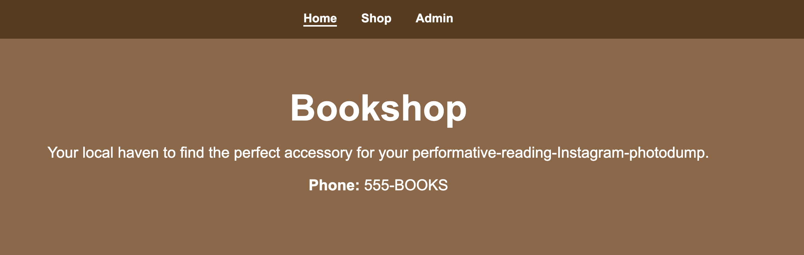
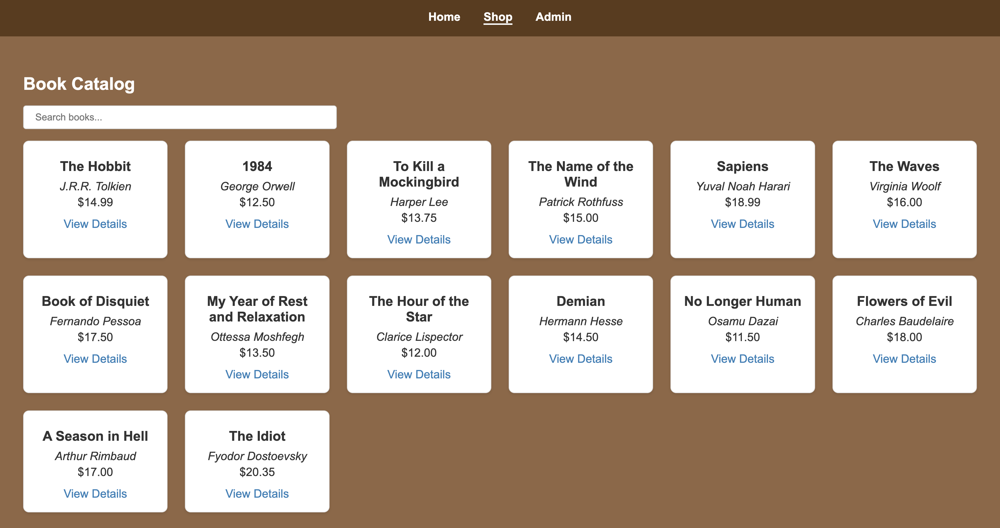
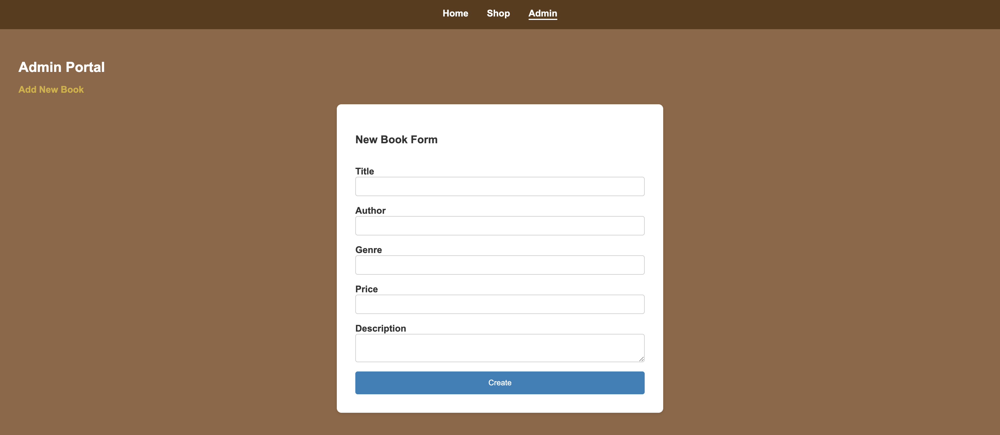

## Description
A React SPA admin portal for "Bookshop". Manage store info and books via a mock JSON API.

## Table of Contents
1. [Demo](#demo)
2. [Setup](#setup)
3. [Testing](#testing)
4. [Features](#features)

## Demo

## Setup

1. Fork and clone the repo.
2. Install dependencies: `npm install`
3. Run backend server: `npm run server`
4. Run the frontend: `npm run dev` 

## Testing

- To run the tests: `npm run test`

## Features
- Landing Page: Fetches and displays store info
- Book Catalog: Searchable list of books
- Details View: View full book info on click
- Admin Panel
- Add new books
